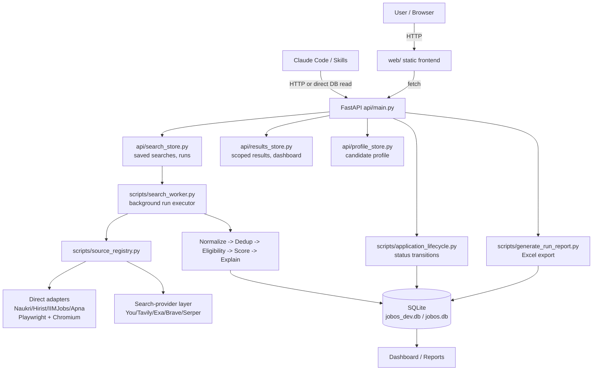

# Architecture

## Two coexisting pipelines

JobOS grew from a single-candidate CLI tool into a multi-candidate web
app. Both still exist in this repository — this is not duplication to
clean up, it's an honest description of what's here:

1. **The current, primary system**: a FastAPI app (`api/`) + a plain
   HTML/CSS/JS frontend (`web/`), backed by SQLite, supporting any
   number of independent candidates. This is what `README.md`'s Quick
   Start describes, and what new users should use.
2. **The legacy, single-candidate CLI pipeline**: `config/profile.json`
   (Saroj's own profile), `data/inbox/job_input.txt`,
   `scripts/process_job_input.py`, `scripts/query_planner.py`,
   `scripts/generate_daily_report.py`, driven by the `/jobos` Claude
   Code slash command. Still functional, still tested, kept for
   backward compatibility — not the recommended entry point for a new
   user.

Both share the same underlying scoring/eligibility/dedup/freshness
logic (`scripts/score_job.py`, `scripts/job_eligibility.py`,
`scripts/cross_source_dedup.py`, `scripts/freshness.py`) — there is
exactly one scoring engine, never two.

## Component diagram (current system)



## Discovery pipeline (every job, either system)

```
Job Source
   |
Source Adapter (JobSourceAdapter)
   |
Normalized Job Object
   |
Deduplication (in-batch + cross-source)
   |
Freshness classification (date-based)
   |
Eligibility Gate (experience + location)
   |
Mandatory Requirement Gate (hard reject)
   |
100-point Scoring Engine
   |
Priority A / B / C / Reject
   |
SQLite (system of record)
   |
Resume/Profile provenance recorded per result
   |
Human review -> Shortlist -> Approve -> (you) Apply -> Track
```

See [SCORING.md](SCORING.md) and
[APPLICATION_LIFECYCLE.md](APPLICATION_LIFECYCLE.md) for the two gates
and the tracking states in full detail.

## Key modules

| Layer | File(s) |
|---|---|
| HTTP API | `api/main.py`, `api/db.py`, `api/schemas.py` |
| Search/run management | `api/search_store.py`, `scripts/search_worker.py` |
| Results/dashboard/export scoping | `api/results_store.py`, `scripts/generate_run_report.py` |
| Candidate profile | `api/profile_store.py`, `scripts/candidate_profile.py`, `scripts/candidate_profile_store.py`, `scripts/resume_extractor.py` |
| Resume storage | `scripts/resume_store.py` |
| Source adapters | `scripts/source_adapter.py` (base ABC), `scripts/source_registry.py` (registry), one file per source |
| Search-provider layer | `scripts/search_provider.py`, `search_provider_manager.py`, `search_provider_adapter.py`, `restricted_source_registry.py` |
| Eligibility | `scripts/job_eligibility.py`, `experience_eligibility.py`, `location_taxonomy.py` |
| Scoring | `scripts/score_job.py`, `scripts/score_explanation.py` |
| Dedup/freshness | `scripts/cross_source_dedup.py`, `scripts/canonical_job.py`, `scripts/freshness.py` |
| Application lifecycle | `scripts/application_lifecycle.py` |
| Frontend | `web/*.html`, `web/app.js`, `web/style.css` (no build step) |
| Claude Skills | `.claude/skills/*/SKILL.md`, `.claude/commands/*.md` |

## Infrastructure present but not (yet) wired into JobOS workflows

- **n8n** (`docker-compose.yml`, port 5678): container runs, but
  `workflows/` is empty — no JobOS automation currently runs through it.
- **macOS launchd** (`launchd/com.sarojjobos.dailysearch.plist`):
  ready-to-install template for the legacy CLI pipeline's daily
  scheduled run. Deliberately **not installed** — installing it is a
  separate, human-approved step.
- **Google Sheets**: mentioned as a planned tracker integration; not
  implemented. The Excel export (`.xlsx`, via `openpyxl`) is the real,
  working reporting mechanism today.

## Data storage

- **Production**: `data/applications/jobos.db` (SQLite) — the single
  system of record. Never migrated/edited by tests.
- **Dev**: `data/applications/jobos_dev.db` — auto-created, safe to
  reset.
- Both share the same schema, built additively via
  `scripts/migrate_v*.py` files, chained in `scripts/init_dev_db.py`.
